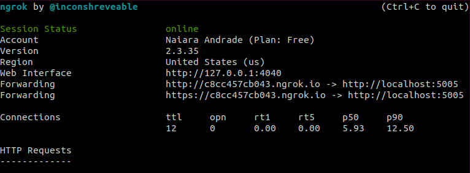

## Conheça a Esther

Esther é um chatbot desenvolvido para responder perguntas frequentes sobre o coronavírus. Está em fase de construção, e para a primeira versão as perguntas foram baseadas do [FAQ da Fiocruz](https://mooc.campusvirtual.fiocruz.br/rea/coronavirus/faq.html).


__________________________


### Como foi construído

Esther é um chatbot desenvolvido com o RASA versão 2. Utiliza o modelo de [FAQ](https://rasa.com/docs/rasa/chitchat-faqs/) disponível nesta versão do rasa. Possui as seguintes intenções:
- Saudação, cumprimento
- Ajuda 
- Sobre o bot e quem o fez
- Despedida
- Fallback

No processo de desenvolvimento alguns usuários se disponibilizaram a testar o bot e assim ajudaram a contribuir com sua evolução.

### Como rodar a Esther?

#### Pré-requisitos:

Antes de rodar a Esther é necessário se atentar aos programas que já devem estar instalados:

- [Docker](https://docs.docker.com/engine/install/ubuntu/)
- [Docker compose](https://docs.docker.com/compose/install/)
- [Ngrok](https://ngrok.com/download)


### Instalação

- [Executar servidor Ngrok](#executar-servidor-ngrok)
- [Configurar webchat](#configurar-webchat)
- [Configurar integração com o Telegram](#configurar-integracao-com-o-telegram)

#### Executar servidor Ngrok

- Na pasta de instalação do ngrok execute para iniciar o servidor:

```bash
./ngrok http 5005
```

Se atente a url do servidor, pois utilizaremos ela nos próximos passos.



Nessa imagem a url fornecia é `https://c8cc457cb043.ngrok.io`. 

#### Configurar webchat

- Para que o bot funcione na web após executar o servidor, copie a url fornecida https e subtitua por "sua_url" no arquivo `credentials.yml` em `rest`.

**obs:** é necessário fazer este passo porque a conta free não permite edição de domínio, para que facilitasse seria necessário a conta paga para que a url fosse fixa.

#### Configurar integração com o Telegram

- Copie a url utlizada na configuração do webchat e subtitua por "sua_url" no arquivo `credentials.yml` em `telegram`.

- Para que o telegram funcione corretamente, é preciso criar um bot pelo [Telegram](https://rasa.com/docs/rasa/connectors/telegram/) usando o [BotFather](https://t.me/botfather).
- Adicione o nome do bot e o token fornecido pelo BotFather no arquivo `credentials.yml`


- Execute o comando 

```bash
sudo docker-compose up
```

- Para ter acesso ao webchat acesse:

[http://localhost:8080/](http://localhost:8080/)

Agora pode conversar com o bot no webchat ou telegram que ele já estará funcionando!

Qualquer dúvida verifique a [documentação do rasa](https://rasa.com/docs/rasa/) que serviu de base de todo o projeto.


### Próximos passos

- Fazer um webhook para salvar conversas em um banco de dados para saber o que e como os usuários estão se comunicando com o bot, podendo assim retreinar e melhorar o modelo aumentando os exemplos e facilitando a usabilidade.
- Fazer deploy da Esther para poder compartilhar o bot de forma web com usuários testes e usuários em geral para poder captar mais dados de interação com o bot e e identificar de novas intents que os usuários demonstrem interesse.
- Analisar os dados das conversar em um sistema de BI para retirar insights das interações com usuários.
- Criação da personalidade da Esther.
- Utilização de slots, como de nome por exemplo, para criar uma conversa mais personalizada.
- Criação de menus com botões que facilitem a interação do usuário com a Esther.
